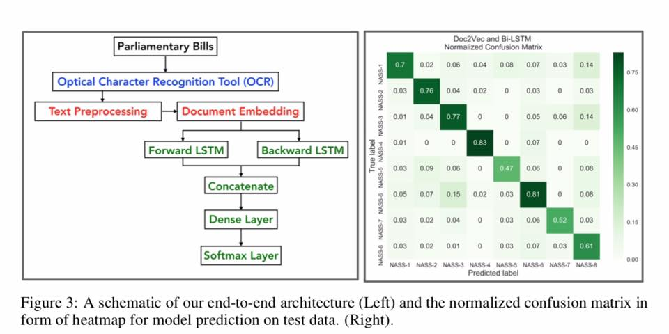
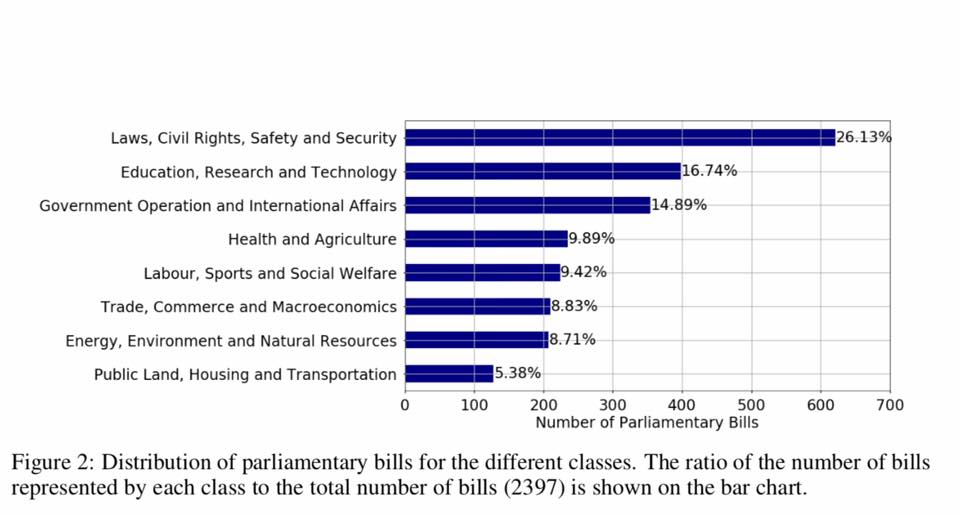
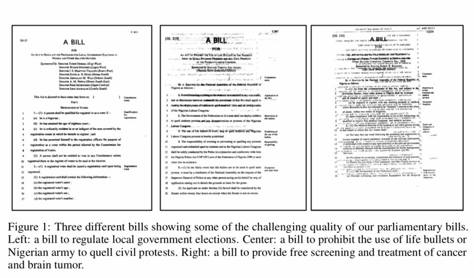

# Artificial-Intelligence-for-Democracy-in-Nigeria

Discover how Artificial Intelligence can help our democracy with an amazing work by Wale Akinfaderin and Olamilekan Mufrad Wahab‬

‪The work used OCR, document level embedding and deep learning to classify messy (embedded/scanned) parliamentary bills introduced in the Nigerian National Assembly in the 4th republic (from 1999 - 2018).

Read at https://arxiv.org/pdf/1910.04865.pdf
